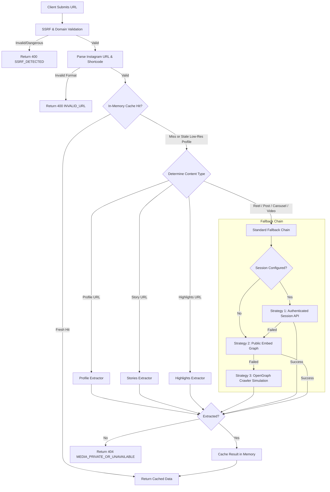

# IgWorld — Project Memory & Technical Architecture Guide

This document serves as the single source of truth for the **IgWorld** (`igworld`) repository. It outlines the system architecture, extraction engine, security protocols, API contracts, component tree, and operational workflows for developers and AI agents working on this codebase.

---

## 1. Project Overview

- **Project Name**: IgWorld (`igworld`)
- **Type**: Production-ready Instagram Media Downloader Web Application & REST API
- **Primary Objective**: Provide ultra-fast, high-definition, client-friendly media extraction and direct streaming downloads for public Instagram content without requiring user login or credentials.
- **Core Technology Stack**:
  - **Framework**: [Next.js 16.3.5](https://nextjs.org/) (App Router, React Server Components + Client Islands)
  - **Core Library**: [React 19.2.8](https://react.dev/)
  - **Language**: [TypeScript 5](https://www.typescriptlang.org/) (Strict Mode)
  - **Styling**: [Tailwind CSS v4](https://tailwindcss.com/) with custom CSS custom properties (light/dark mode)
  - **Icons**: [Lucide React](https://lucide.dev/) (`^1.45.0`)
  - **Runtime**: Node.js (required on server routes due to native `dns` module, `Buffer`, and stream handling)

---

## 2. Directory & File Structure

```text
igworld/
├── .env.example                     # Environment template with production & local defaults
├── .env.local                       # Local environment overrides (git-ignored)
├── AGENTS.md                        # Next.js 16 agent guidelines and rules
├── CLAUDE.md                        # Cross-agent pointer to AGENTS.md
├── memory.md                        # (This file) Core technical memory & architecture documentation
├── next.config.ts                   # Next.js config (allowed image remote patterns)
├── package.json                     # Scripts & dependencies
├── postcss.config.mjs               # PostCSS configuration for Tailwind v4
├── tsconfig.json                    # TypeScript configuration with `@/*` path alias
├── public/                          # Static assets, PWA manifest, and icons
│   ├── favicon.ico
│   ├── manifest.json
│   └── icons/
└── src/
    ├── app/                         # Next.js App Router
    │   ├── layout.tsx               # Root layout (Navbar, Footer, SEO Schema, Theme)
    │   ├── page.tsx                 # Universal Instagram downloader home page
    │   ├── globals.css              # Global styles, Tailwind v4 imports, CSS variables
    │   ├── robots.ts                # Dynamic robots.txt generation
    │   ├── sitemap.ts               # Dynamic XML sitemap generator
    │   ├── contact/page.tsx         # Contact & support page
    │   ├── copyright/page.tsx       # Copyright information
    │   ├── dmca/page.tsx            # DMCA takedown notice & procedure
    │   ├── privacy-policy/page.tsx  # Privacy policy
    │   ├── terms-of-service/page.tsx# Terms of service
    │   ├── instagram-carousel-downloader/page.tsx
    │   ├── instagram-highlights-downloader/page.tsx
    │   ├── instagram-igtv-downloader/page.tsx
    │   ├── instagram-post-downloader/page.tsx
    │   ├── instagram-profile-picture-downloader/page.tsx
    │   ├── instagram-reels-downloader/page.tsx
    │   ├── instagram-story-downloader/page.tsx
    │   ├── instagram-video-downloader/page.tsx
    │   └── api/
    │       └── v1/
    │           ├── download/route.ts # Primary POST endpoint for media resolution
    │           ├── stream/route.ts   # Media streaming proxy with byte-range support
    │           └── health/route.ts   # API health check endpoint
    ├── components/
    │   ├── downloader/
    │   │   ├── DownloaderForm.tsx    # Input field, paste button, URL parser, submit trigger
    │   │   ├── ResultCard.tsx        # Media preview, quality badge, caption, download buttons
    │   │   ├── CarouselSlider.tsx    # Multi-item carousel viewer for album posts
    │   │   └── ToolTabs.tsx          # Navigation tabs across the 8 Instagram tool types
    │   ├── layout/
    │   │   ├── Navbar.tsx            # Navigation header with tool dropdown and mobile drawer
    │   │   ├── Footer.tsx            # SEO links, legal disclaimer, copyright, tool links
    │   │   └── ThemeToggle.tsx       # Dark/light mode switcher with local storage persistence
    │   ├── monetization/
    │   │   └── AdSlot.tsx            # Non-intrusive responsive banner ad placement component
    │   ├── seo/
    │   │   ├── Breadcrumbs.tsx       # Semantic breadcrumb trail navigation
    │   │   ├── FaqAccordion.tsx      # Accessible expandable FAQ section
    │   │   └── StructuredData.tsx    # JSON-LD Schema.org injector (SoftwareApp, WebSite, FAQ)
    │   ├── tool/
    │   │   └── ToolPageTemplate.tsx  # Generic layout template for dedicated tool routes
    │   └── ui/
    │       └── InstagramIcon.tsx     # Custom SVG Instagram glyph
    └── lib/
        ├── constants.ts              # Tool definitions, feature sets, FAQs, SEO metadata
        ├── cache/
        │   └── memoryCache.ts        # In-memory TTL cache (10 min) for resolved media
        ├── extractor/
        │   ├── index.ts              # Master extraction orchestrator & fallback cascade
        │   ├── directApi.ts          # Authenticated session extraction & worker account pool
        │   ├── embed.ts              # Public embed graph & JSON parser
        │   ├── opengraph.ts          # OpenGraph meta tag crawler simulation
        │   ├── profile.ts            # High-resolution profile picture extraction
        │   ├── stories.ts            # Public & session-based Instagram Stories resolver
        │   ├── highlights.ts         # Instagram Highlights & short-token decoder
        │   ├── errors.ts             # Normalized extraction error classes & helpers
        │   └── htmlDecoder.ts        # HTML entity decoder for captions and titles
        ├── security/
        │   ├── ssrf.ts               # SSRF protection, IP normalization, DNS checks
        │   ├── ratelimit.ts          # In-memory IP rate limiter (sliding window)
        │   ├── cors.ts               # Configurable dynamic CORS headers
        │   └── sanitize.ts           # Instagram URL regex parser, ID extractor, shortcodes
        └── types/
            └── api.ts                # TypeScript interfaces for API requests, responses, models
```

---

## 3. Supported Tools & Content Types

The system supports 8 dedicated Instagram tool types, configured in `src/lib/constants.ts`:

| Tool ID | Slug | Display Name | Content Type |
| :--- | :--- | :--- | :--- |
| `reels` | `/instagram-reels-downloader` | Reels Downloader | High-definition MP4 videos with audio |
| `video` | `/instagram-video-downloader` | Video Downloader | Feed videos and multi-format video posts |
| `post` | `/instagram-post-downloader` | Photo & Post Downloader | Single photo/image posts in highest resolution |
| `carousel` | `/instagram-carousel-downloader` | Carousel Downloader | Multi-slide albums (mixed photos and videos) |
| `story` | `/instagram-story-downloader` | Story Downloader | Active 24-hour stories from public profiles |
| `highlights` | `/instagram-highlights-downloader` | Highlights Downloader | Saved public highlights and `/s/` short links |
| `profile` | `/instagram-profile-picture-downloader` | Profile Picture Downloader | Full-size (1080px+) HD avatar pictures |
| `igtv` | `/instagram-igtv-downloader` | IGTV Downloader | Long-form videos originally published to IGTV |

---

## 4. Media Extraction Pipeline (`src/lib/extractor`)

The extraction pipeline in `src/lib/extractor/index.ts` coordinates a tiered fallback strategy designed to maximize extraction success while avoiding unnecessary authenticated API calls.



### Extraction Strategies:
1. **Authenticated Session API (`directApi.ts`)**:
   - Uses server-side worker session tokens configured in `INSTAGRAM_SESSION_ID` or `INSTAGRAM_SESSION_IDS`.
   - Supports round-robin rotation across multiple worker accounts.
   - Accepts per-request client overrides via the `X-Instagram-Session` header.
   - Converts base64 shortcodes to 64-bit integer numeric Media IDs via `shortcodeToMediaId()`.
   - Fetches rich metadata including carousel items, original audio tracks, view counts, and direct CDN URLs.
2. **Public Embed Graph (`embed.ts`)**:
   - Fetches the public embed endpoint (`https://www.instagram.com/p/{shortcode}/embed/captioned/`).
   - Extracts embedded JSON or parses DOM structures for CDN video and image URLs without requiring session cookies.
3. **OpenGraph HTML Scraper (`opengraph.ts`)**:
   - Emulates social crawler user agents (Googlebot / WhatsApp) to read `og:video`, `og:image`, and `og:description` metadata.
4. **Dedicated Sub-Extractors**:
   - `profile.ts`: Resolves public profiles to retrieve uncropped 1080x1080 avatar pictures instead of 150x150 thumbnails.
   - `stories.ts`: Fetches ephemeral story media for a user.
   - `highlights.ts`: Decodes base64 `/s/` highlight tokens (`decodeHighlightShareToken`) to numeric IDs and extracts highlight reels.

---

## 5. Media Proxy & Streaming Engine (`/api/v1/stream`)

Instagram CDN URLs (`*.cdninstagram.com`, `*.fbcdn.net`) are protected by cross-origin policies, referer headers, and hotlinking restrictions. The internal streaming proxy resolves this:

- **Endpoint**: `GET /api/v1/stream?url=<encoded_cdn_url>&filename=<name>&type=<mp4|jpg>&disposition=<attachment|inline>`
- **Features**:
  - **SSRF Verified**: Targets must resolve to approved CDN hostnames (`ALLOWED_CDN_HOSTS`).
  - **HTTP Byte-Range Requests**: Forwards client `Range` headers to upstream servers and returns `206 Partial Content`, enabling instant video seeking and scrubber support on mobile devices.
  - **Size Guard**: Max limit of 300 MB (`MAX_STREAM_BYTES`) to prevent memory exhaustion attacks.
  - **Clean Filenames**: Sanitizes user-provided filenames (`[a-zA-Z0-9._-]`) and forces proper extensions (`.mp4` or `.jpg`).
  - **Content-Disposition**: Defaults to `attachment` for instant downloads, or `inline` for browser previews.

---

## 6. Security Architecture (`src/lib/security`)

### 1. SSRF Mitigation (`src/lib/security/ssrf.ts`)
- **Host Whitelisting**: Restricts outgoing requests to authorized domains:
  - Instagram hosts: `instagram.com`, `www.instagram.com`, `m.instagram.com`, `instagr.am`, `scontent.cdninstagram.com`.
  - CDN hosts: `*.cdninstagram.com`, `*.fbcdn.net`, `*.instagram.com`, `images.unsplash.com`, `commondatastorage.googleapis.com`.
- **IP Address Validation**:
  - Resolves target hostnames using native Node.js DNS (`dns.promises.lookup`).
  - Rejects private IP subnets (`10.0.0.0/8`, `172.16.0.0/12`, `192.168.0.0/16`).
  - Rejects loopback addresses (`127.0.0.0/8`, `::1`).
  - Rejects link-local and cloud metadata addresses (`169.254.169.254`).
  - Normalizes IPv4-mapped IPv6 addresses (`::ffff:x.x.x.x`).
  - Evaluates alternate IP notations (pure integer, octal, hexadecimal).
- **Safe Fetch**: Follows redirects manually up to 3 hops, re-validating the target host at every step (`safeFetchWithRedirects`).

### 2. Rate Limiting (`src/lib/security/ratelimit.ts`)
- Sliding window in-memory rate limiter keyed by client IP (retrieved via `x-forwarded-for`).
- Default: 30 requests per 60,000 ms (configurable via `RATE_LIMIT_MAX_REQUESTS` and `RATE_LIMIT_WINDOW_MS`).
- Returns HTTP `429 Too Many Requests` with `Retry-After` and `X-RateLimit-Remaining: 0`.

### 3. URL Sanitization (`src/lib/security/sanitize.ts`)
- Strict regex matching for Instagram links:
  - Reels: `/reel/[A-Za-z0-9_-]+/`
  - Posts / Carousels: `/p/[A-Za-z0-9_-]+/`
  - IGTV: `/tv/[A-Za-z0-9_-]+/`
  - Stories: `/stories/[username]/[id]/`
  - Highlights: `/stories/highlights/[id]/` or `/s/[base64_token]`
  - Profiles: `/[username]/` or `@username`
- Strips URL tracking query parameters (`igsh`, `utm_source`, `utm_medium`).

### 4. CORS Policy (`src/lib/security/cors.ts`)
- Evaluates `Origin` header against `ALLOWED_ORIGINS` environment variable.
- Defaults to allowing same-origin and common mobile origins (`capacitor://localhost`, `ionic://localhost`).

---

## 7. API Specification

### `POST /api/v1/download`
Extracts and resolves media details from an Instagram URL.

- **Headers**:
  - `Content-Type: application/json`
  - `X-Instagram-Session: <token>` *(Optional client override)*
- **Request Body**:
  ```json
  {
    "url": "https://www.instagram.com/reel/C3...",
    "tool": "reels"
  }
  ```
- **Success Response (HTTP 200)**:
  ```json
  {
    "success": true,
    "timestamp": 1773794200,
    "data": {
      "id": "1234567890",
      "shortcode": "C3...",
      "type": "video",
      "isReel": true,
      "caption": "Post caption here",
      "author": {
        "username": "creator",
        "fullName": "Creator Name",
        "avatarUrl": "https://...",
        "isVerified": true
      },
      "metrics": {
        "likes": 12500,
        "comments": 340,
        "views": 98000
      },
      "media": [
        {
          "id": "1234567890_1",
          "type": "video",
          "thumbnailUrl": "/api/v1/stream?url=...",
          "downloadUrl": "/api/v1/stream?url=...",
          "directUrl": "https://scontent.cdninstagram.com/...",
          "width": 1080,
          "height": 1920,
          "quality": "1080p HD",
          "extension": "mp4",
          "hasAudioTrack": true
        }
      ],
      "sourceUrl": "https://www.instagram.com/reel/C3...",
      "timestamp": 1773794000
    }
  }
  ```
- **Error Response (HTTP 400 / 401 / 403 / 404 / 429 / 500)**:
  ```json
  {
    "success": false,
    "error": {
      "code": "MEDIA_PRIVATE_OR_UNAVAILABLE",
      "message": "The requested Instagram media could not be retrieved.",
      "suggestion": "Verify that the post or account is 100% public."
    }
  }
  ```

---

## 8. Configuration & Environment Variables

| Variable | Required | Default | Description |
| :--- | :--- | :--- | :--- |
| `NEXT_PUBLIC_BASE_URL` | Yes | `https://igworld.app` | Canonical domain used in SEO, sitemaps, and Open Graph |
| `PORT` | No | `3000` | Port for local server |
| `NODE_ENV` | No | `development` | Runtime environment (`development`, `production`, `test`) |
| `ALLOWED_ORIGINS` | No | See `.env.example` | Comma-separated list of CORS origins |
| `RATE_LIMIT_MAX_REQUESTS` | No | `30` | Max requests per rate limit window |
| `RATE_LIMIT_WINDOW_MS` | No | `60000` | Rate limit window in milliseconds (1 minute) |
| `INSTAGRAM_SESSION_ID` | No | `""` | Single worker session token for private/story extraction |
| `INSTAGRAM_SESSION_IDS` | No | `""` | Comma-separated list of worker tokens for round-robin rotation |
| `REDIS_URL` | No | `""` | Optional Redis connection for cluster rate limiting |
| `HTTP_PROXY` / `HTTPS_PROXY` | No | `""` | Optional upstream residential proxy |
| `NEXT_PUBLIC_GOOGLE_ADSENSE_ID` | No | `""` | Google AdSense publisher ID (`ca-pub-XXXXXXXXXXXX`) |
| `NEXT_PUBLIC_ADSENSE_SLOT_LEADERBOARD` | No | `""` | Optional specific ad unit slot ID for 728x90 leaderboard |
| `NEXT_PUBLIC_ADSENSE_SLOT_RECTANGLE` | No | `""` | Optional specific ad unit slot ID for 300x250 rectangle |
| `NEXT_PUBLIC_GOOGLE_SITE_VERIFICATION` | No | `""` | Google Search Console / AdSense meta verification token |

---

## 9. Development & Verification Workflows

### Standard Commands
```bash
# Start local development server (http://localhost:3000)
npm run dev

# Run TypeScript compilation check without emitting files
npm test # (runs tsc --noEmit)

# Run ESLint validation
npm run lint

# Build production bundle
npm run build

# Start production server
npm start
```

---

## 10. Key Development Rules & Gotchas

1. **Next.js 16 Breaking Changes**: Refer to `AGENTS.md`. Always test route parameters, layouts, and async APIs against Next.js 16 conventions.
2. **Node.js Runtime on APIs**: All routes under `src/app/api/v1/` must declare `export const runtime = "nodejs"` because they rely on Node's native `dns` module for SSRF prevention, `Buffer`, and stream handling.
3. **No Leaking Secrets**: Never expose `INSTAGRAM_SESSION_ID`, cookies, or upstream proxy credentials in client components or client bundles. Keep all session handling strictly within server modules (`src/lib/extractor/*`).
4. **Never Direct-Link Instagram CDNs in Download Anchors**: Always route download buttons through `/api/v1/stream?url=...` to ensure proper `Content-Disposition`, bypass cross-origin restrictions, and deliver reliable file downloads across iOS and Android.
5. **Cache Invalidation**: The in-memory cache automatically busts stale profile picture entries if the cached width is `< 1000px`, ensuring high-resolution avatars are fetched when available.
